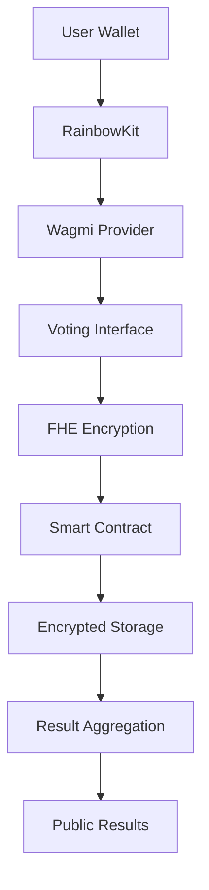

# 🛡️ Confidential Vote Dashboard

> **Next-Generation Privacy-Preserving Voting Platform**  
> Built with Fully Homomorphic Encryption (FHE) for complete vote confidentiality

[](https://vercel.com/new/clone?repository-url=https://github.com/FHEResearcher/confidential-vote-dash)
[](https://opensource.org/licenses/MIT)
[](https://www.typescriptlang.org/)
[](https://reactjs.org/)

## 🌟 What Makes This Special?

Unlike traditional voting systems, our platform ensures **complete privacy** through:

- 🔐 **FHE Encryption**: Votes remain encrypted during computation
- 🚫 **Zero-Knowledge**: No individual vote is ever revealed
- ⛓️ **Blockchain Transparency**: Results are verifiable and immutable
- 🎯 **Real-time Processing**: Instant vote aggregation without decryption

## 🚀 Quick Start

### Prerequisites
- Node.js 18+ 
- Web3 wallet (MetaMask, Rainbow, etc.)
- Sepolia testnet ETH

### Installation

```bash
# Clone the repository
git clone https://github.com/FHEResearcher/confidential-vote-dash.git
cd confidential-vote-dash

# Install dependencies
npm install

# Configure environment
cp .env.example .env
# Edit .env with your configuration

# Start development server
npm run dev
```

Visit `http://localhost:5173` and connect your wallet to start voting!

## 🏗️ Architecture



## 🔧 Tech Stack

| Layer | Technology | Purpose |
|-------|------------|---------|
| **Frontend** | React + TypeScript + Vite | Modern UI framework |
| **Styling** | Tailwind CSS + shadcn/ui | Beautiful, responsive design |
| **Blockchain** | Wagmi + Viem + RainbowKit | Web3 integration |
| **Encryption** | FHE (Fully Homomorphic) | Privacy-preserving computation |
| **Network** | Ethereum Sepolia | Testnet deployment |
| **Deployment** | Vercel | Fast, global hosting |

## 📋 Features

### 🗳️ Voting System
- **Anonymous Voting**: Your identity is never linked to your vote
- **Encrypted Scores**: Vote values remain hidden until reveal
- **Real-time Updates**: Live progress tracking
- **Result Verification**: Cryptographic proof of integrity

### 🔐 Security Features
- **End-to-End Encryption**: Votes encrypted from submission to aggregation
- **Decentralized Storage**: No single point of failure
- **Audit Trail**: Immutable voting records
- **Reputation System**: Voter credibility tracking

### 🎨 User Experience
- **Intuitive Interface**: Clean, modern design
- **Mobile Responsive**: Works on all devices
- **Wallet Integration**: Seamless Web3 connection
- **Progress Tracking**: Visual voting status

## 🛠️ Development

### Smart Contract Deployment

```bash
# Compile contracts
npm run compile

# Deploy to Sepolia
npm run deploy:sepolia

# Deploy locally
npm run deploy:local
```

### Environment Variables

Create a `.env` file with:

```env
# Blockchain Configuration
VITE_CHAIN_ID=11155111
VITE_RPC_URL=https://sepolia.infura.io/v3/YOUR_KEY
VITE_WALLET_CONNECT_PROJECT_ID=YOUR_PROJECT_ID

# Contract Addresses
VITE_VOTING_CONTRACT_ADDRESS=0x...
VITE_FHE_CONTRACT_ADDRESS=0x...
```

## 📊 Usage Examples

### Creating a Voting Session

```typescript
// Create a new voting session
const sessionId = await createVotingSession({
  title: "Best DeFi Project 2024",
  description: "Vote for the most innovative DeFi protocol",
  duration: 7 * 24 * 60 * 60, // 7 days
  projectIds: [1, 2, 3, 4, 5]
});
```

### Casting an Encrypted Vote

```typescript
// Cast a vote with FHE encryption
const voteId = await castVote({
  projectId: 1,
  sessionId: sessionId,
  score: encryptedScore, // FHE encrypted
  inputProof: proof
});
```

## 🚀 Deployment

### Vercel (Recommended)

1. **Connect Repository**: Link your GitHub repo to Vercel
2. **Configure Environment**: Add all required environment variables
3. **Deploy**: Automatic deployment on every push

See [VERCEL_DEPLOYMENT.md](./VERCEL_DEPLOYMENT.md) for detailed instructions.

### Manual Deployment

```bash
# Build for production
npm run build

# Deploy to your hosting provider
# Upload the 'dist' folder
```

## 🔍 Smart Contract Details

### ConfidentialVoting Contract

```solidity
contract ConfidentialVoting {
    // Core voting functions
    function castVote(uint256 projectId, uint256 sessionId, externalEuint32 score, bytes calldata inputProof) external;
    function createVotingSession(string memory title, string memory description, uint256 duration, uint256[] memory projectIds) external;
    function revealResults(uint256 sessionId) external;
    
    // View functions
    function getProjectInfo(uint256 projectId) external view returns (...);
    function getVotingSessionInfo(uint256 sessionId) external view returns (...);
    function hasUserVoted(address user, uint256 sessionId) external view returns (bool);
}
```

## 🤝 Contributing

We welcome contributions! Please see our [Contributing Guidelines](CONTRIBUTING.md).

### Development Workflow

1. **Fork** the repository
2. **Create** a feature branch: `git checkout -b feature/amazing-feature`
3. **Commit** your changes: `git commit -m 'Add amazing feature'`
4. **Push** to the branch: `git push origin feature/amazing-feature`
5. **Open** a Pull Request

## 📈 Roadmap

- [ ] **Multi-chain Support**: Ethereum, Polygon, Arbitrum
- [ ] **Advanced Voting**: Ranked choice, quadratic voting
- [ ] **Mobile App**: React Native implementation
- [ ] **Governance Integration**: DAO voting mechanisms
- [ ] **Analytics Dashboard**: Voting insights and statistics

## 🐛 Troubleshooting

### Common Issues

| Issue | Solution |
|-------|----------|
| Wallet not connecting | Check network (Sepolia), ensure wallet is unlocked |
| Contract interaction fails | Verify contract address, check gas fees |
| Build errors | Clear node_modules, reinstall dependencies |
| Environment variables not working | Ensure variables start with `VITE_` |

### Getting Help

- 📖 **Documentation**: Check our [Wiki](https://github.com/FHEResearcher/confidential-vote-dash/wiki)
- 🐛 **Bug Reports**: [Create an issue](https://github.com/FHEResearcher/confidential-vote-dash/issues)
- 💬 **Discussions**: [Join our community](https://github.com/FHEResearcher/confidential-vote-dash/discussions)

## 📄 License

This project is licensed under the MIT License - see the [LICENSE](LICENSE) file for details.

## 🙏 Acknowledgments

- **Zama**: For FHE technology and tooling
- **RainbowKit**: For excellent wallet integration
- **shadcn/ui**: For beautiful UI components
- **Vercel**: For seamless deployment platform

## 📞 Contact

- **GitHub**: [@FHEResearcher](https://github.com/FHEResearcher)
- **Email**: [Contact us](mailto:contact@example.com)
- **Twitter**: [@FHEResearcher](https://twitter.com/FHEResearcher)

---

<div align="center">

**Built with ❤️ for the future of private voting**

[⭐ Star this repo](https://github.com/FHEResearcher/confidential-vote-dash) • [🐛 Report Bug](https://github.com/FHEResearcher/confidential-vote-dash/issues) • [💡 Request Feature](https://github.com/FHEResearcher/confidential-vote-dash/issues)

</div>