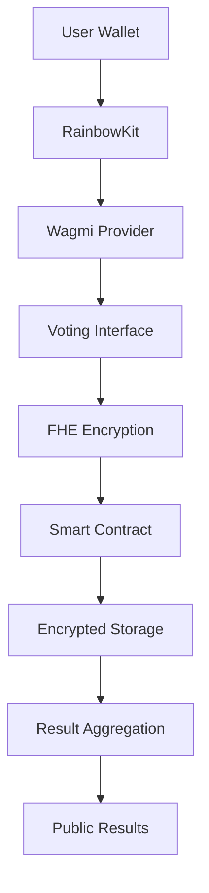

# 🛡️ Confidential Vote Dashboard

> **Next-Generation Privacy-Preserving Voting Platform**  
> Built with Fully Homomorphic Encryption (FHE) for complete vote confidentiality

[](https://vercel.com/new/clone?repository-url=https://github.com/FHEResearcher/confidential-vote-dash)
[](https://opensource.org/licenses/MIT)
[](https://www.typescriptlang.org/)
[](https://reactjs.org/)

## 🌟 What Makes This Special?

Unlike traditional voting systems, our platform ensures **complete privacy** through:

- 🔐 **FHE Encryption**: Votes remain encrypted during computation
- 🚫 **Zero-Knowledge**: No individual vote is ever revealed
- ⛓️ **Blockchain Transparency**: Results are verifiable and immutable
- 🎯 **Real-time Processing**: Instant vote aggregation without decryption

## 🚀 Quick Start

### Prerequisites
- Node.js 18+ 
- Web3 wallet (MetaMask, Rainbow, etc.)
- Sepolia testnet ETH

### Installation

```bash
# Clone the repository
git clone https://github.com/FHEResearcher/confidential-vote-dash.git
cd confidential-vote-dash

# Install dependencies
npm install

# Configure environment
cp .env.example .env
# Edit .env with your configuration

# Start development server
npm run dev
```

Visit `http://localhost:8080` and connect your wallet to start voting!

## 🏗️ Architecture



## 🔧 Tech Stack

| Layer | Technology | Purpose |
|-------|------------|---------|
| **Frontend** | React + TypeScript + Vite | Modern UI framework |
| **Styling** | Tailwind CSS + Radix UI | Component library |
| **Wallet** | Wagmi v2 + RainbowKit | Web3 wallet integration |
| **FHE** | @zama-fhe/relayer-sdk | Client-side encryption |
| **Blockchain** | Solidity + FHEVM | Smart contract with FHE |
| **Network** | Sepolia Testnet | Ethereum test network |

## 🔐 FHE Encryption Flow

### 1. Client-Side Encryption
```typescript
// Create encrypted input
const input = instance.createEncryptedInput(contractAddress, voterAddress);
input.add32(score); // Add vote score (1-10)

// Encrypt the data
const encryptedInput = await input.encrypt();
```

### 2. Smart Contract Processing
```solidity
// Receive encrypted vote
euint32 internalScore = FHE.fromExternal(score, inputProof);

// Update encrypted totals
projects[projectId].totalVotes = FHE.add(projects[projectId].totalVotes, FHE.asEuint32(1));
projects[projectId].totalScore = FHE.add(projects[projectId].totalScore, internalScore);

// Set ACL permissions
FHE.allow(projects[projectId].totalVotes, msg.sender);
```

### 3. Result Decryption
```typescript
// Decrypt aggregated results
const handleContractPairs = [
  { handle: encryptedData.totalVotes, contractAddress: CONTRACT_ADDRESS },
  { handle: encryptedData.totalScore, contractAddress: CONTRACT_ADDRESS }
];
const result = await instance.userDecrypt(handleContractPairs);
```

## 🚀 Deployment

### Smart Contract Deployment

```bash
# Compile contracts
npm run compile

# Deploy to Sepolia
npm run deploy:sepolia
```

### Frontend Deployment

```bash
# Build for production
npm run build

# Deploy to Vercel
vercel --prod
```

## 🔍 Smart Contract Details

### ConfidentialVoting Contract

```solidity
contract ConfidentialVoting {
    // Core voting functions
    function castVote(uint256 projectId, uint256 sessionId, externalEuint32 score, bytes calldata inputProof) external;
    function createVotingSession(string memory title, string memory description, uint256 duration, uint256[] memory projectIds) external;
    function revealResults(uint256 sessionId) external;
    
    // View functions
    function getProjectInfo(uint256 projectId) external view returns (...);
    function getVotingSessionInfo(uint256 sessionId) external view returns (...);
    function hasUserVoted(address user, uint256 sessionId) external view returns (bool);
    
    // FHE-specific functions
    function getProjectEncryptedTotals(uint256 projectId) external view returns (bytes32, bytes32);
    function requestResultsDecryption(uint256 sessionId) external;
}
```

## 🎯 Key Features

### Privacy Protection
- **FHE Encryption**: All votes encrypted end-to-end
- **Zero-Knowledge**: Individual choices never revealed
- **ACL Control**: Precise access control for decryption

### Transparency & Verifiability
- **Blockchain Records**: All operations recorded on-chain
- **Immutable Results**: Vote results cannot be tampered with
- **Public Verification**: Anyone can verify the process

### User Experience
- **Modern UI**: Clean, intuitive interface
- **Wallet Integration**: Seamless Web3 wallet connection
- **Real-time Updates**: Instant feedback and status updates

## 🤝 Contributing

We welcome contributions! Please see our [Contributing Guidelines](CONTRIBUTING.md).

### Development Workflow

1. **Fork** the repository
2. **Create** a feature branch: `git checkout -b feature/amazing-feature`
3. **Commit** your changes: `git commit -m 'Add amazing feature'`
4. **Push** to the branch: `git push origin feature/amazing-feature`
5. **Open** a Pull Request

## 📈 Roadmap

- [ ] **Multi-chain Support**: Ethereum, Polygon, Arbitrum
- [ ] **Advanced Voting**: Ranked choice, quadratic voting
- [ ] **Mobile App**: React Native implementation
- [ ] **Governance Integration**: DAO voting mechanisms
- [ ] **Analytics Dashboard**: Voting statistics and insights

## 🔗 Links

- [Live Demo](https://confidential-vote-dash.vercel.app)
- [Documentation](https://docs.confidential-vote-dash.com)
- [Zama FHE Docs](https://docs.zama.ai/)
- [FHEVM Documentation](https://docs.fhevm.org/)

## 📄 License

This project is licensed under the MIT License - see the [LICENSE](LICENSE) file for details.

---

**Built with ❤️ by the FHE Research Team**